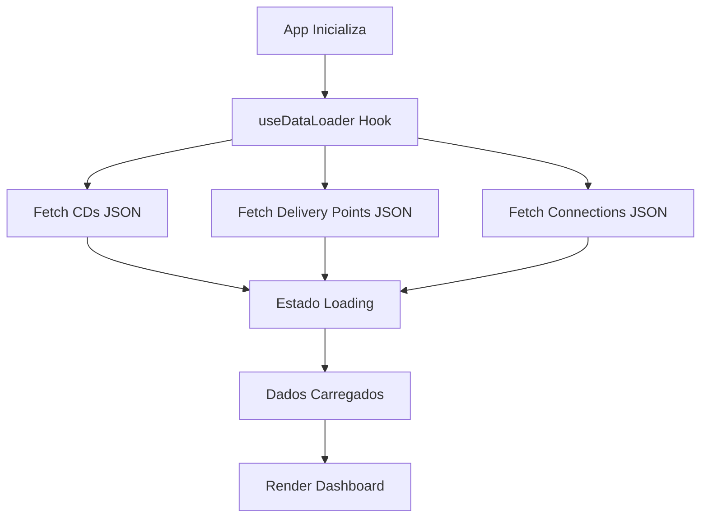
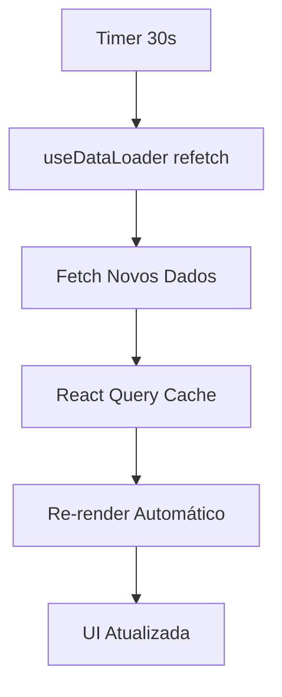
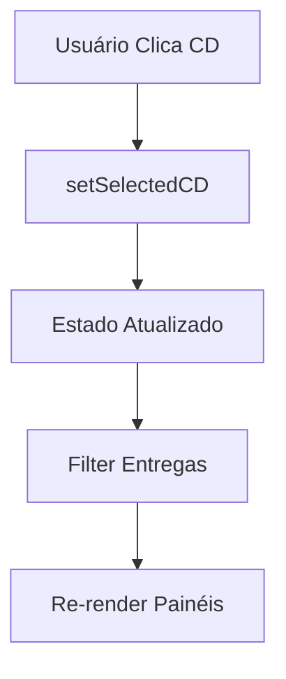

# Arquitetura do Sistema - Route Atlas DMS Dashboard

## Visão Geral da Arquitetura

O Route Atlas é uma aplicação Single Page Application (SPA) construída com React e TypeScript, seguindo uma arquitetura modular e escalável.

## Stack Tecnológico

### Frontend
- **React 18**: Biblioteca principal para interface de usuário
- **TypeScript**: Tipagem estática para maior robustez
- **Vite**: Build tool moderna e rápida
- **Tailwind CSS**: Framework CSS utility-first
- **shadcn-ui**: Biblioteca de componentes baseada em Radix UI

### Gerenciamento de Estado
- **React Query (TanStack Query)**: Cache e sincronização de dados
- **React Hooks**: Estado local dos componentes

### Roteamento
- **React Router DOM**: Navegação client-side

### Ícones e Assets
- **Lucide React**: Biblioteca de ícones SVG
- **Arquivos JSON**: Armazenamento de dados local

## Estrutura do Projeto

```
route-atlas/
├── public/                    # Assets estáticos
│   ├── robots.txt
│   └── favicon.ico
├── src/
│   ├── components/            # Componentes React
│   │   ├── ui/               # Componentes base (shadcn)
│   │   │   ├── badge.tsx
│   │   │   ├── button.tsx
│   │   │   ├── card.tsx
│   │   │   └── ...
│   │   ├── DMSDashboard.tsx  # Dashboard principal
│   │   └── RouteVisualization.tsx # Visualização SVG
│   ├── data/                 # Dados JSON
│   │   ├── cds.json
│   │   ├── delivery-points.json
│   │   ├── cd-connections.json
│   │   └── README.md
│   ├── hooks/                # Custom hooks
│   │   └── useDataLoader.ts
│   ├── lib/                  # Utilitários
│   │   └── utils.ts
│   ├── pages/                # Páginas/Rotas
│   │   ├── Index.tsx
│   │   └── NotFound.tsx
│   ├── App.tsx              # Componente raiz
│   ├── main.tsx             # Entry point
│   └── index.css            # Estilos globais
├── docs/                     # Documentação
├── package.json
├── vite.config.ts
├── tailwind.config.ts
└── tsconfig.json
```

## Arquitetura de Componentes

### Hierarquia de Componentes

```
App
├── QueryClientProvider
│   ├── TooltipProvider
│   │   ├── BrowserRouter
│   │   │   ├── Routes
│   │   │   │   ├── Route "/" → Index
│   │   │   │   │   └── DMSDashboard
│   │   │   │   │       ├── RouteVisualization
│   │   │   │   │       ├── Card (Métricas)
│   │   │   │   │       ├── Card (CDs)
│   │   │   │   │       └── Card (Entregas)
│   │   │   │   └── Route "*" → NotFound
│   │   │   ├── Toaster
│   │   │   └── Sonner
```

### Componentes Principais

#### 1. DMSDashboard
- **Responsabilidade**: Componente principal que orquestra todo o dashboard
- **Estado**: Gerencia CD selecionado e dados carregados
- **Subcomponentes**: Cards de métricas, visualização de rotas, painéis laterais

#### 2. RouteVisualization
- **Responsabilidade**: Renderização SVG do mapa interativo
- **Props**: Dados de CDs, pontos de entrega e conexões
- **Interação**: Seleção de CDs e hover effects

#### 3. Componentes UI (shadcn)
- **Badge**: Status e prioridades
- **Button**: Ações do usuário
- **Card**: Containers de conteúdo
- **Separator**: Divisores visuais

## Fluxo de Dados

### 1. Carregamento Inicial



### 2. Atualização Automática



### 3. Interação do Usuário



## Padrões de Design

### 1. Custom Hooks

**useDataLoader**
```typescript
const useDataLoader = (refetchInterval: number) => {
  // Lógica de carregamento e cache
  return { cds, deliveryPoints, cdConnections, isLoading, error };
};
```

**Vantagens**:
- Reutilização de lógica
- Separação de responsabilidades
- Testabilidade

### 2. Composition Pattern

```typescript
// Componente composto
const Dashboard = () => (
  <div>
    <Header />
    <MetricsGrid />
    <MainContent />
    <Sidebar />
  </div>
);
```

### 3. Props Drilling Mitigation

Uso de React Query para gerenciamento de estado global:
```typescript
// Dados disponíveis em qualquer componente
const { data: cds } = useQuery(['cds'], fetchCDs);
```

## Performance e Otimizações

### 1. React Query Cache

```typescript
const queryClient = new QueryClient({
  defaultOptions: {
    queries: {
      staleTime: 30000,      // 30 segundos
      refetchInterval: 30000, // Auto-refetch
      retry: 3,              // Tentativas em caso de erro
    },
  },
});
```

### 2. Lazy Loading

```typescript
// Carregamento sob demanda de rotas
const LazyPage = lazy(() => import('./pages/SomePage'));
```

### 3. Memoization

```typescript
// Evita re-renders desnecessários
const MetricsCard = memo(({ title, value, icon }) => (
  <Card>
    <CardContent>{value}</CardContent>
  </Card>
));
```

### 4. SVG Optimization

- Uso de SVG para visualização escalável
- Elementos simples para performance
- Event handlers otimizados

## Tratamento de Estados

### 1. Estados da Aplicação

```typescript
interface AppState {
  // Dados
  cds: CD[];
  deliveryPoints: DeliveryPoint[];
  cdConnections: CDConnection[];
  
  // UI State
  selectedCD: string | null;
  isLoading: boolean;
  error: string | null;
}
```

### 2. Estados de Loading

- **Initial Load**: Spinner centrado
- **Background Refresh**: Indicador discreto
- **Error State**: Mensagem e retry

### 3. Estados de Interação

- **CD Selection**: Highlight visual e filtragem
- **Hover Effects**: Feedback visual imediato

## Segurança

### 1. Validação de Dados

```typescript
// Validação client-side básica
const validateData = (data: unknown): data is ValidData => {
  return typeof data === 'object' && data !== null;
};
```

### 2. Sanitização

- Escape de strings em JSX (automático no React)
- Validação de IDs e referências

### 3. CORS

```typescript
// Vite config para desenvolvimento
export default {
  server: {
    cors: true,
    proxy: {
      '/api': 'http://localhost:3000'
    }
  }
};
```

## Escalabilidade

### 1. Modularização

Componentes organizados por funcionalidade:
```
components/
├── dashboard/
│   ├── MetricsCard.tsx
│   ├── CDPanel.tsx
│   └── DeliveryPanel.tsx
├── visualization/
│   ├── SVGMap.tsx
│   └── RouteVisualization.tsx
└── ui/
    └── (componentes base)
```

### 2. API Abstraction

```typescript
// Cliente API abstrato
class APIClient {
  async get<T>(endpoint: string): Promise<T> {
    // Implementação genérica
  }
}
```

### 3. Configuration Management

```typescript
// Configurações centralizadas
const config = {
  refreshInterval: 30000,
  apiBaseUrl: process.env.VITE_API_URL,
  maxRetries: 3,
};
```

## Testabilidade

### 1. Estrutura para Testes

```typescript
// Hook testável
export const useDataLoader = (interval: number) => {
  // Lógica isolada e testável
};

// Componente testável
export const MetricsCard = ({ data }: Props) => {
  // Componente puro, fácil de testar
};
```

### 2. Mocking

```typescript
// Mock para testes
jest.mock('./hooks/useDataLoader', () => ({
  useDataLoader: () => ({
    cds: mockCDs,
    isLoading: false,
    error: null
  })
}));
```

## Deployment Architecture

### 1. Build Process

```bash
npm run build  # Vite build otimizado
```

Resultado:
- HTML minificado
- CSS otimizado e purgado
- JS com tree-shaking e code-splitting

### 2. Hosting Options

**Static Hosting**:
- Vercel, Netlify, GitHub Pages
- CDN automático
- HTTPS incluído

**Container Deployment**:
```dockerfile
FROM nginx:alpine
COPY dist/ /usr/share/nginx/html/
```

### 3. Environment Configuration

```typescript
// Configuração por ambiente
const config = {
  development: {
    apiUrl: 'http://localhost:3000',
    debug: true
  },
  production: {
    apiUrl: 'https://api.routeatlas.com',
    debug: false
  }
};
```

## Monitoring e Observabilidade

### 1. Error Boundaries

```typescript
class ErrorBoundary extends Component {
  componentDidCatch(error: Error, errorInfo: ErrorInfo) {
    // Log errors
    console.error('Dashboard Error:', error, errorInfo);
  }
}
```

### 2. Performance Monitoring

```typescript
// Performance tracking
const trackPageLoad = () => {
  const loadTime = performance.now();
  analytics.track('page_load', { duration: loadTime });
};
```

### 3. User Analytics

```typescript
// Event tracking
const trackCDSelection = (cdId: string) => {
  analytics.track('cd_selected', { cdId });
};
```

## Considerações Futuras

### 1. Microfrontends

Preparação para arquitetura distribuída:
- Module Federation
- Independent deployments
- Team autonomy

### 2. Real-time Features

- WebSocket integration
- Server-Sent Events
- Optimistic updates

### 3. Offline Support

- Service Workers
- Local storage
- Sync quando online

### 4. Mobile Optimization

- Responsive design
- Touch interactions
- Progressive Web App